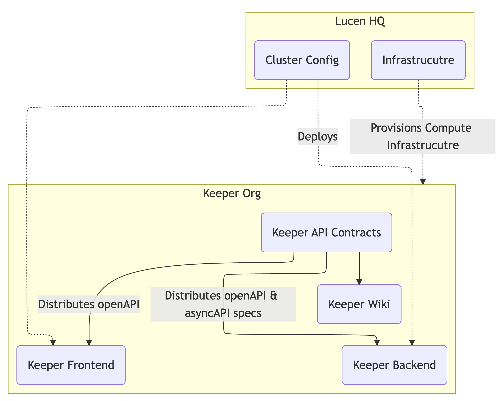

# Repositories

This project is split into multiple repositories to separate concerns and allow for independent development and deployment of different components.

## List of Repositories

- **keeper-frontend**: Keeper Frontend connected to the keeper-backend via REST API.
- **keeper-backend**: Backend service that handles business logic, database interactions, and communication. Also publishes an image and helm chart for deployment.
- **keeper-operator**: Kubernetes Operator responsible for managing PostgreSQL clusters, handling tasks such as provisioning, scaling, and backups.
- **keeper-wiki**: Documentation and research related to the project, including design decisions, architecture diagrams, and implementation details.
- **keeper-api-contracts**: Shared API contracts and data models used by both the frontend and backend to ensure consistent communication.

## Dependencies

### LucenHQ

Lucen-HQ will provision Infrastructure on AWS to run Keeper and the workload clusters, it also includes cluster life cycle management and monitoring.
Lucen-HQ all has the `cluster-config` repository which configures the `keeper` components and manages the running applications on the management cluster from `CNI`, `CNPG`, `Gateway-API` and `Alloy` to scrape metrics will be setup there.

### Vellum-IO (Keeper-Org)

The central component is the `keeper-api-contracts`, it includes openapi specs and async api specs for NATs and communication with the frontend.
